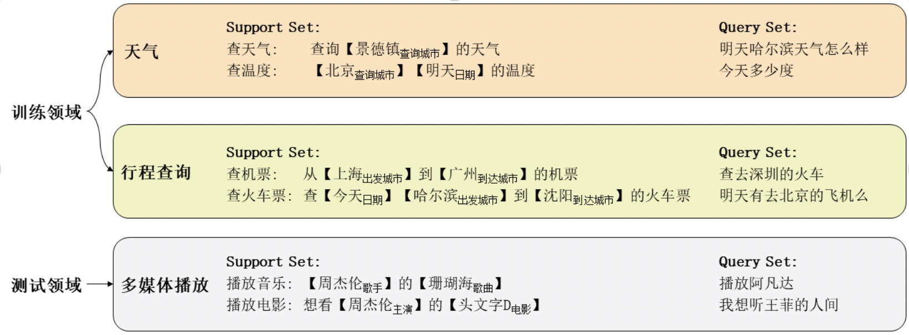

#### **任务1：小样本对话语言理解技术评测**

【背景介绍】

   近年来，人工智能在深度学习方法的帮助下取得了令人瞩目的成就。然而目前的深度学习方法都需要大量的标注训练数据，而在真实的落地场景下，大量人工标注数据往往是很难获得的。以任务型对话为例，产品开发时往往难以获得待开发功能的真实用户语料。即使有生语料，任务型对话开发也面临着人工数据标注成本高昂的挑战。同时，像对话系统这样的人工智能应用往往面临着需求频繁变化的问题，导致繁重数据标注任务常常需要反复进行。反观人类，人在学习一个新的任务时只需要少数几个样例。这种巨大的反差启发科研人员开始探索能够像人一样，利用先前经验和少量数据进行学习的人工智能系统。 

   小样本学习（Few-shot Learning）就是专门针对上述问题的新兴研究方向。小样本学习专门研究如何利用过往经验知识，在新的任务上只使用少数几个样例数据进行学习，通常在新的任务上每个类别只有1-5个样例数据。关于小样本的研究以往主要集中在图像领域，自然语言领域的小样本研究有着独特的挑战且有较大的实际意义，是非常值得探索的新兴研究领域。

本次评测中，我们着眼于任务型对话系统中对话语言理解任务（SLU，Spoken Language Understanding）的小样本学习问题。对话语言理解是任务型对话系统的关键组成模块，它负责将用户输入的自然语言转化为结构化的语义框架（Semantic Frame），为后续的对话管理模块和回复生成模块提供支持。如图二所示，任务型对话频繁面临新的需求和领域，而SLU模块针对不同领域的标注规范往往差异较大，使得SLU模块经常面临数据不足的严峻考验。综上，本次评测既有开拓自然语言下小样本问题的研究意义，同时也兼有切实的实际应用意义。

 

【任务描述】

   对话语言理解SLU（Spoken Language Understanding）是任务型对话系统的关键组成模块，它把用户的自然语言输入（Utterance）转化为结构化信息（Semantic Frame）以为后续的对话状态管理和回复生成提供支持。其中Semantic Frame包括用户意图（Intent）和语义槽（Slot）。

   区别于普通的对话语言理解，本评测关注小样本学习场景，即每个测试类别只有几个标注样例。具体任务如图三所示，模型先在一些数据充足的领域训练，然后在未见的新领域上测试。针对一个领域，我们每次给定模型一个带标注的支撑样本集（Support Set）作为参考，让模型对任意未见过的查询样本集（Query Set）标注用户意图和槽位。以图三中测试领域为例，给定Support Set，和Query句“播放阿凡达”，模型需要预测出意图为“播放电影”，槽位为【电影：阿凡达】。（通常训练时为模拟小样本情形，训练领域数据也会构造为Support-Query 形式训练模型，这里我们不做强制要求）

 



 

【评测方式】

1. \1. 训练数据集：

若干富数据领域的单轮对话语料，每条语料标注有意图Intent和语义槽Slot。

评测队伍可以视自己需要对数据进行处理、训练。

1. \2. 测试数据集：

若干个**训练集未出现**领域的数据，每个领域公开一个支撑集Support Set，模型在对应查询集Query Set上进行评测，Query Set数据不公开。

每个Support Set保证任意一个意图类别和语义槽类别**至少**被3条语料覆盖。每个Domain中意图类别有5-10种，语义槽类别有5-20种。

（评测队伍针对每个领域提交一个模型文件，不同领域的数据和测试过程彼此独立。）

1. \3. 开发数据集：

格式同测试数据，我们同时公开每个领域的Support Set数据和Query Set数据。

评测队伍根据自己的需要使用。

1. \4. 数据格式：

数据采用json格式，每条语料的标注格式如下：

```
[
   {
      "text": "查询今天的天气",
      "domain": "查询助手",
      "intent": "查天气",
      "slots"：{
       "日期": "今天"
     }
  },
]
```

 

【评价指标】

评测队伍为每个测试领域提交一个模型文件，评测系统使用参赛队伍提供模型在每个测试领域的Query Set上进行Intent和Slot预测。具体评价方式如下：

● 对于小样本意图分类任务，我们采用准确率（acc）来评价，当意图识别的结果和标准答案相同时才被认为正确。

● 对于小样本语义槽填充任务，我们采用F1-score作为评价指标，当预测的槽位的一个key-value组合与标准答案的一个key-value组合完全一致视为一个正确预测。

● 综合评价，我们采用句准确率（sentence acc）来衡量模型意图识别和语义槽填充的综合能力，当一句话Intent和Slot都识别正确才算正确预测，其余算错误预测。

我们会给出三项分别排名作为参考，最终比赛排名以sentence acc为准。

 

【奖励设置】

一等奖（1名）20,000元

二等奖（2名）各10,000元

三等奖（4名）各2,500元

 

【相关资源】

论文:
**Few-shot Slot Tagging with Collapsed Dependency Transfer and Label-enhanced Task-adaptive Projection Network.** *Yutai Hou, Wanxiang Che, Yongkui Lai, Zhihan Zhou, Yijia Liu, Han Liu, Ting Liu.* ACL 2020. [[pdf](https://file.aconf.org/conf/hz/2020/03/174917/files/2006_05702.pdf)]

 

【任务负责人】

车万翔（哈尔滨工业大学）

联系人：侯宇泰（哈尔滨工业大学）、茅佳峰（哈尔滨工业大学）

联系方式：

茅佳峰-[jfmao@ir.hit.edu.cn](mailto:jfmao@ir.hit.edu.cn)

侯宇泰-[ythou@ir.hit.edu.cn](mailto:ythou@ir.hit.edu.cn)

 
