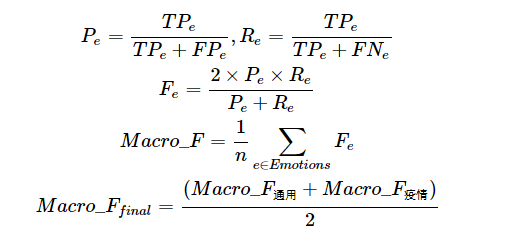
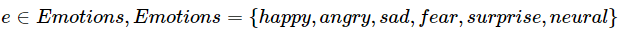

## **SMP2020微博情绪分类评测 SMP2020-EWECT**

------

## 欢迎各位参加SMP2020微博情绪分类评测！

## SMP2020微博情绪分类技术评测（SMP2020-EWECT）

 

### **欢迎**

    欢迎来到SMP2020微博情绪分类技术评测（The Evaluation of Weibo Emotion Classification Technology，SMP2020-EWECT）。

    “第九届全国社会媒体处理大会（The Ninth China National Conference on Social Media Processing）”2020年9月4-6日在浙江杭州召开。全国社会媒体处理大会专注于以社会媒体处理为主题的科学研究与工程开发，为传播社会媒体处理最新的学术研究与技术成果提供广泛的交流平台，旨在构建社会媒体处理领域的产学研生态圈，成为中国乃至世界社会媒体处理的风向标，会议将以社交网络的形式改变传统的学术会议交流体验。全国社会媒体处理大会每年举办一次，现已成为社会媒体处理的重要学术活动。第九届全国社会媒体处理大会（SMP2020）由中国中文信息学会社会媒体处理专委会主办，浙江大学承办。

    在本届SMP会议上，我们将举办微博情绪分类技术评测。情感分析技术一直是自然语言处理领域研究的重点内容之一。2020年，新冠肺炎疫情成为了全国人民关注的焦点，众多用户针对此次疫情在新浪微博等社交媒体平台上发表自己的看法，蕴含了非常丰富的情感信息。基于自然语言处理技术自动识别社交媒体文本中的情绪信息，可以帮助政府了解网民对各个事件的态度，及时发现人民的情绪波动，从而更有针对性地制定政策方针，具有重要的社会价值。尽管之前的社交媒体情感分析技术已经取得了不错的进展，但是如何将之前的研究成果快速高效地应用到疫情相关的数据当中，仍然是一个值得研究的问题。本次评测任务中，参赛成员不仅需要分析普通微博中的情绪，还要专门针对疫情相关微博进行情绪分析。

    本届微博情绪分类技术评测由中国中文信息学会社会媒体处理专委会主办，哈尔滨工业大学承办并提供标注数据集，微热点大数据研究院提供原始数据及奖金，旨在促进社交媒体情感分析相关研究的发展，为本领域的学术研究人员和产业界从业人员提供一个良好的沟通平台。

    热烈欢迎对微博情绪分类感兴趣的团队和个人积极报名参赛！

 

**■ 评测内容**

#### **评测任务概述**

    本届微博情绪分类评测任务一共包含两个测试集：第一个为通用微博数据集，其中的微博是随机收集的包含各种话题的数据；第二个为疫情微博数据集，其中的微博数据均与本次疫情相关。

任务描述如下：

    微博情绪分类任务旨在识别微博中蕴含的情绪，输入是一条微博，输出是该微博所蕴含的情绪类别。在本次评测中，我们将微博按照其蕴含的情绪分为以下六个类别之一：积极、愤怒、悲伤、恐惧、惊奇和无情绪。

    两个数据集的各类情绪微博举例如下表所示：

 

|  情绪  | 通用微博数据集                                               | 疫情微博数据集                                               |
| :----: | :----------------------------------------------------------- | :----------------------------------------------------------- |
|  积极  | 哥，你猜猜看和喜欢的人一起做公益是什么感觉呢。我们的项目已经进入一个新阶段了，现在特别有成就感。加油加油。 | 愿大家平安、健康[心]#致敬疫情前线医护人员# 愿大家都健康平安  |
|  愤怒  | 每个月都有特别气愤的时候。，多少个瞬间想甩手不干了，杂七杂八，当我是什么。 | 整天歌颂医护人员伟大的自我牺牲精神，人家原本不用牺牲好吧！吃野味和隐瞒疫情的估计是同一波人，真的要死自己去死，别拉上无辜的人。 |
|  悲伤  | 回忆起老爸的点点滴滴，心痛…为什么.接受不了                   | 救救武汉吧，受不了了泪奔，一群孩子穿上大人衣服学着救人 请官方不要瞒报谎报耽误病情，求求武汉zf了[泪][泪][泪][泪] |
|  恐惧  | 明明是一篇言情小说，看完之后为什么会恐怖的睡不着呢，越想越害怕[吃驚] | 对着这个症状，没病的都害怕[允悲][允悲]                       |
|  惊奇  | 我竟然不知道kkw是丑女无敌里的那个                            | 我特别震惊就是真的很多人上了厕所是不会洗手的。。。。         |
| 无情绪 | 我们做不到选择缘分，却可以珍惜缘分。                         | 辟谣，盐水漱口没用。                                         |

####  

#### **数据集说明**

    本次技术评测使用的标注数据集由哈尔滨工业大学社会计算与信息检索研究中心提供，原始数据源于新浪微博，由微热点大数据研究院提供，数据集分为两部分。

    第一部分为通用微博数据集，该数据集内的微博内容是随机获取到微博内容，不针对特定的话题，覆盖的范围较广。

    第二部分为疫情微博数据集，该数据集内的微博内容是在疫情期间使用相关关键字筛选获得的疫情微博，其内容与新冠疫情相关。

    因此，本次评测训练集包含上述两类数据：通用微博训练数据和疫情微博训练数据，相对应的，测试集也分为通用微博测试集和疫情微博测试集。参赛成员可以同时使用两种训练数据集来训练模型。

    每条微博被标注为以下六个类别之一：neural（无情绪）、happy（积极）、angry（愤怒）、sad（悲伤）、fear（恐惧）、surprise（惊奇）。

    通用微博训练数据集包括29,768条微博，测试数据集包含5,000条微博。

    疫情微博训练数据集包括6,606条微博，测试数据集包含5,000条微博。

    注意：测试数据集的各个类别分布与训练集相同。实际发布的测试集中会包含混淆数据，混淆数据不作为测点，在最终结果评测时会预先去除。

    训练数据集以xlsx格式发布，包含三列：数据编号，文本，情绪标签。示例如下：

| 数据编号 |                             文本                             | 情绪标签 |
| :------: | :----------------------------------------------------------: | :------- |
|    1     | 每个月都有特别气愤的时候。，多少个瞬间想甩手不干了，杂七杂八，当我是什么。 | angry    |

 

    测试数据集以xlsx格式发布，包含两列：数据编号，文本。示例如下：

| 数据编号 |                             文本                             |
| :------: | :----------------------------------------------------------: |
|    1     | #全国已确诊新型肺炎病例319例#中国加油!一定会过去的，相信医生，相信国家，相信医护人员!!! ?? |

#### **评价指标**

    本次评测以宏平均F1值作为评测指标，最终，我们会对通用微博测试集的测试结果和疫情微博的测试结果进行平均，作为最终的测试结果，即：

其中

 

**注册报名**

有意向参加的单位机构请直接填写[在线报名表](https://docs.qq.com/form/fill/DZGVJT256eUxOREtP?_w_tencentdocx_form=1)，或者扫描下方二维码进入在线报名表填写。

报名存在任何问题，请联系评测会务组：[smp2020ewect@163.com](https://smp2020.aconf.cn/smp2020ewect@163.com)。

 

 

**重要日期**

以下所有时间点为北京时间（GMT+8）11:59 PM

除报名时间以外，其他时间点可能会有变动，请注册参加者密切关注本网站以及邮件通知。

 

| 事件                                       | 时间                        |
| :----------------------------------------- | :-------------------------- |
| 报名                                       | 2020年5月16日-2020年6月15日 |
| 发布训练集                                 | 2020年6月16日               |
| 发布评测集，参赛队伍开始提交程序及运行结果 | 2020年8月8日                |
| 参赛队伍提交运行结果截止时间               | 2020年8月10日               |
| 公布最终评测结果                           | 2020年8月15日               |
| 撰写技术报告                               | 2020年8月1日-2020年8月31日  |
| SMP2020大会期间召开ECDT研讨会及颁奖典礼    | 2020年9月4日-2020年9月6日   |

 

 

**竞赛规则与提交物**

\1. 每支参赛队伍最多不超过10名队员。

\2. 每支参赛队伍需指定一名队长，名称不超过15个字符。

\3. 每名选手只能参加一支队伍，一旦发现某位选手参加多支队伍，将取消所有相关队伍的参赛资格。

\4. 各参赛单位不可以使用除承办方提供的训练数据之外的带有情绪标签的标注数据（未标注数据和其他任务的标注数据可用），如若不确定外部数据是否可用，请发邮件与组委会联系。

\5. 评测时，承办方给定带有混淆数据的测试集，各参评单位运行参赛系统并提交全部测试数据结果，承办方再从提交结果中去除混淆数据后得出最终的评测结果。

\6. 提交物：每支队伍需在提交最终结果截止时间之前，提交评测集的最终结果。最终需要提交**可运行的代码和测试结果**，以邮件附件的形式发送到smp2020ewect@163.com，**邮件主题为”队伍名称-SMP2020微博情绪分类评测提交”**。代码以压缩包的形式提交，命名为”队伍名称-代码.zip”。 测试结果包含两个文件：通用测试集上的最终结果文件命名为“队伍名称-通用.txt”，疫情测试集上的最终结果文件命名为“队伍名称-疫情.txt”，格式形如：

数据编号 标签

**注意：每行是一条数据结果，数据编号与标签之间用制表符t分隔，标签类别同训练集。数据编号需要保证与发布测试集的数据编号相同。提交的结果文件必须是无BOM的UTF-8格式文本文件；文件中不要有多余的空格。**

 

 

**奖励**

| **奖项** | **名额** | **奖金额度** |
| -------- | -------- | ------------ |
| 一等奖   | 1        | 10,000元     |
| 二等奖   | 2        | 5,000元      |
| 三等奖   | 3        | 3,000元      |

 

 

**论文发表**

    本技术评测将与国际期刊Data Intelligence（http://www.data-intelligence.org/）合作，获奖的优秀模型将有机会以单独或综述的方式在该刊上发表技术论文，发表的论文将会获得期刊颁发的奖励。

 

 

**评测委员会**

**主席**：赵妍妍（哈尔滨工业大学）

**副主席**：刘益东（微热点大数据研究院）

**评测委员会成员**：袁明琛（哈尔滨工业大学）、吴方舟（微热点大数据研究院）、王帅（哈尔滨工业大学）

 

 

**联系方式**

如果有任何与本次评测相关的问题，请随时联系会务组。

**评测会务组邮箱**：[smp2020ewect@163.com](https://smp2020.aconf.cn/smp2020ewect@163.com)

 

 

**致谢**

**主办方：**中国中文信息学会社会媒体处理专业委员会（CIPS-SMP）

**承办方：**哈尔滨工业大学社会计算与信息检索研究中心（哈工大SCIR）

**赞助方：**微热点大数据研究院

 
