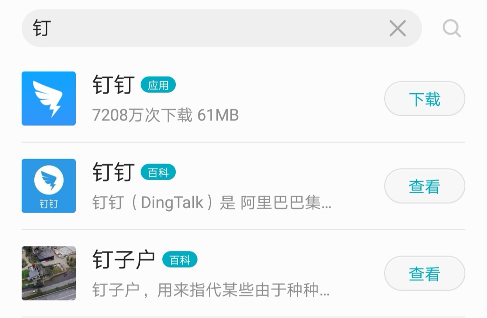

# OGeek算法挑战赛
https://tianchi.aliyun.com/competition/entrance/231688/information

- **题目背景**

- 在搜索业务下有一个场景叫实时搜索（Instance Search）,就是在用户不断输入过程中，实时返回查询结果。

- 此次赛题来自OPPO手机搜索排序优化的一个子场景，并做了相应的简化，意在解决query-title语义匹配的问题。简化后，本次题目内容主要为一个实时搜索场景下query-title的ctr预估问题。本次赛题为开放型算法挑战赛，优秀的解决方案会对我们解决这个场景以及其它场景下的问题带来极大的启发。我们期待优秀的你和你的团队能够投入进来！

- OPPO场景：
  

- **题目内容
  **基于百万最新真实用户搜索数据的实时搜索场景下搜索结果ctr预估。
  给定用户输入prefix（用户输入，查询词前缀）以及文章标题、文章类型等数据，预测用户是否点击。文章资源类别非全网资源，属部分垂直领域内容。初赛后期开放B榜开放时间3小时，请在三小时内提交结果；初赛结束时需要提交完整代码，最终晋级复赛前100名；复赛全程采用线上赛形式。

- **数据描述
  **此次初赛数据约235万 训练集200万，验证集5万，A榜测试集5万，B榜测试集25万，数据全部来源于OPPO日常搜索真实用户点击数据，数据集内可能存在重复、矛盾、同一搜索词对应多个点击等都是真实存在的。

- 数据格式： 数据分4列，\t分隔

- | 字段             | 说明                                                         | 数据示例                                  |
  | ---------------- | ------------------------------------------------------------ | ----------------------------------------- |
  | prefix           | 用户输入（query前缀）                                        | 刘德                                      |
  | query_prediction | 根据当前前缀，预测的用户完整需求查询词，最多10条；预测的查询词可能是前缀本身，数字为统计概率 | {“刘德华”: “0.5”, “刘德华的歌”: “0.3”, …} |
  | title            | 文章标题                                                     | 刘德华                                    |
  | tag              | 文章内容标签                                                 | 百科                                      |
  | label            | 是否点击                                                     | 0或1                                      |

- 
  初赛数据量：
  训练数据：200万

- 验证数据：5万

- 测试数据1：5万

- 测试数据2：25万

- 样例数据：
  挂号 {"挂号信是什么": "0.023", "挂号网上预约": "0.029", "挂号网官网": "0.015", "挂号信": "0.082", "挂号": "0.066", "挂号信单号查询": "0.075", "挂号平台": "0.025", "挂号网": "0.225", "挂号信查询": "0.201", "挂号信查询中国邮政": "0.020", "挂号预约": "0.021"} 预约挂号网 应用 1
  挂号 {"挂号信是什么": "0.023", "挂号网上预约": "0.029", "挂号网官网": "0.015", "挂号信": "0.082", "挂号": "0.066", "挂号信单号查询": "0.075", "挂号平台": "0.025", "挂号网": "0.225", "挂号信查询": "0.201", "挂号信查询中国邮政": "0.020", "挂号预约": "0.021"} 挂号网 网站 0

- 文本编码格式：UTF-8

- 

- **复赛说明**

- 复赛数据包括1个数据包和4个词向量。oppo_data_round2_20181107包含此次复赛所需的训练集，验证集和测试集。四个文件（merge_sgns_bigram_char300.tar.gz、sgns.merge.char.tar.gz、sgns.merge.word.tar.gz、sgns.merge.bigram.tar.gz）为词向量，这四个词向量均为同一份综合语料通过不同方法训练得到的四种预训练词向量，参见https://github.com/Embedding/Chinese-Word-Vectors。

- 

- **复赛平台使用和要求。**（[链接](https://tianchi.aliyun.com/forum/new_articleDetail.html?postsId=35749)）

- 

- **复赛要求：**

- 1）除停用词等小文件外不得上传第三方数据。

- 2）**模型数量**不多于2个**（[说明链接](https://tianchi.aliyun.com/forum/new_articleDetail.html?postsId=37531)）**；

- 3）最终代码在平台上时间限定为CPU方案8小时，GPU方案16小时内完成**训练和预测**。两者都采用的方案**总时间**限制为16小时。

- 4） 禁止人工标注/修改评测结果数据；

- 5）复赛平台不允许上传及运行与比赛无关的数据和代码，一经发现收回账号权限。

- 
  **结果提交说明
  **本次竞赛要求选手按照测试集顺序生成 **csv 结果文件，压缩成 zip 文件提交**，文件名不限。每行是一个预测结果的标签值，不需要表头，示例如下：
  0

- 1

- 1

- 
  **评分标准
  **

- 

- 本次竞赛的评价标准采用F1 score 指标，正样本为1。计算方法参考https://en.wikipedia.org/wiki/F1_score

- 
  **注意事项**

- 为了更加贴近真实情况，测试集中完全相同的词条有很多，证明该词条在真实环境中的搜索比例比较大，在评测中相应权重应该较大，体现在出现频率较高。

- 
  **此赛题需要参赛者注意以下行为：**
  1） 禁止人工标注/修改评测结果数据；
  2）模型数量限制不多于2个；

- 3）除训练词向量和预训练的词向量外禁止使用第三方数据，预训练词向量需注明出处和链接，训练词向量需提交完整脚本；
  4）禁止多账号刷分等。

- 
  **关于模型数量限制的补充说明：**
  比赛中，使用多个模型的结果进行简单融合，被认为是多模型策略。我们不鼓励过度堆砌模型和硬件来刷高比赛得分的行为。为倡导比赛算法的创新性和实用性，我们在大赛过程中对“多模型策略”进行限制。分2个阶段进行说明：
  a)预测阶段
  大赛要求预测阶段仅能使用不超过2个的模型。
  注意：同一网络结构但参数不同也被认为是不同模型。

- b)预处理阶段
  我们认定预处理阶段的数据处理中使用到word2vec等词向量模型不计入模型数量，其他有不确定的情况可以到技术圈提问。
